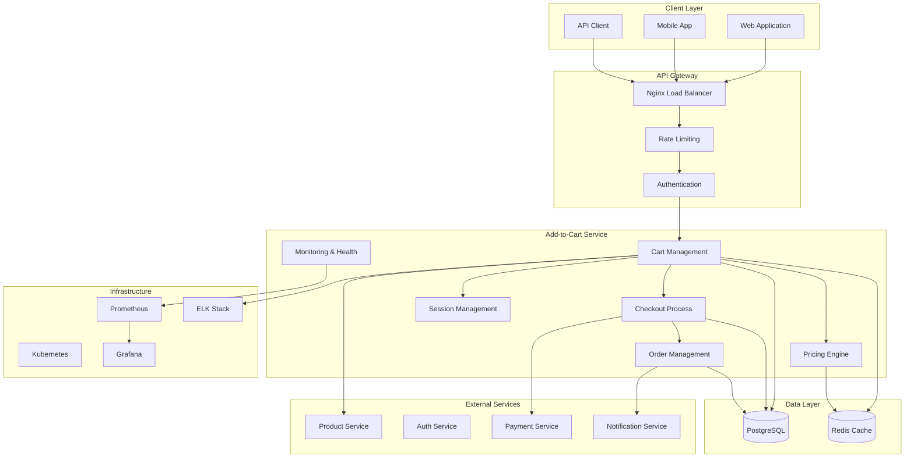
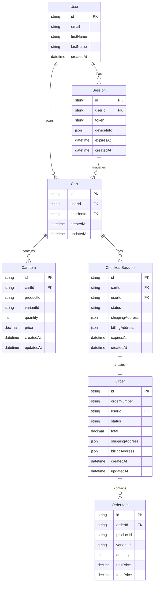
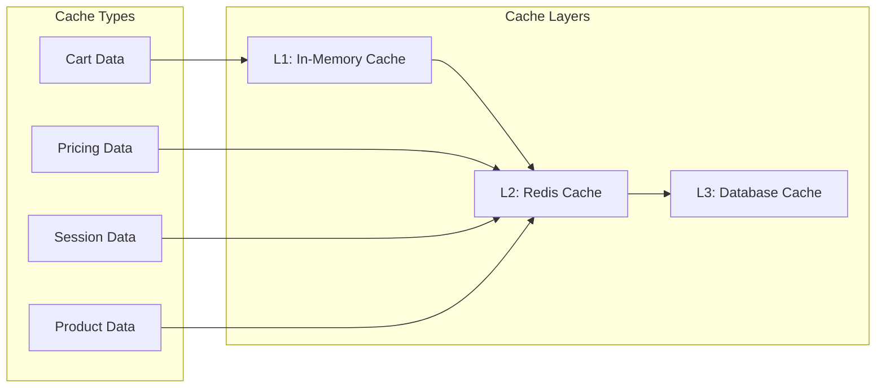
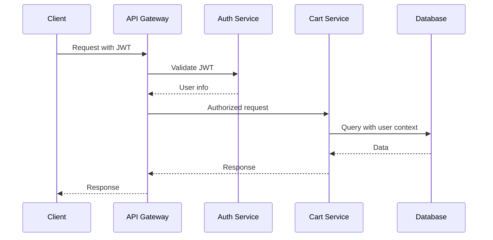
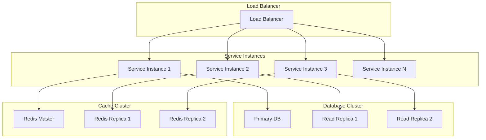
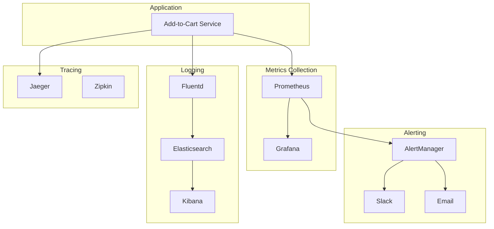
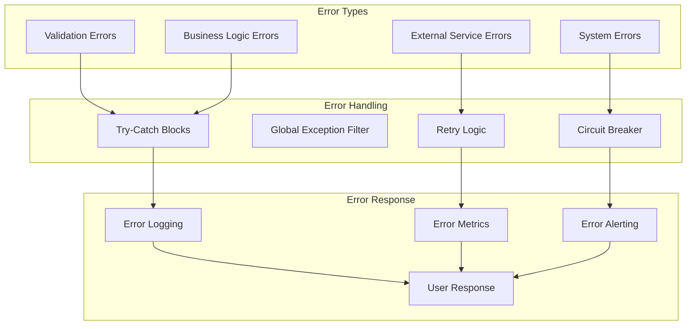
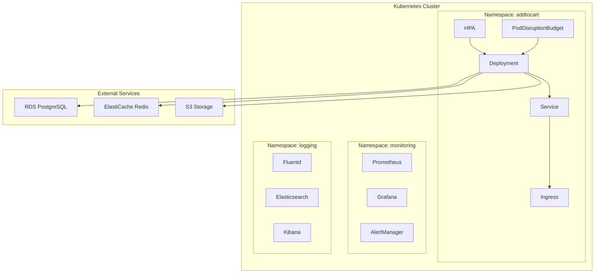
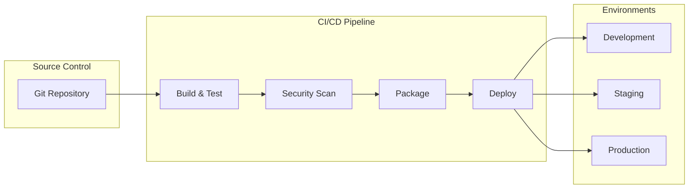

# 🏗️ Add-to-Cart Service Architecture

## Overview

The Add-to-Cart Service is a microservice designed to handle shopping cart operations, inventory management, pricing calculations, and checkout preparation. It's built using NestJS framework with a focus on scalability, reliability, and maintainability.

## System Architecture

### High-Level Architecture



## Service Components

### 1. Cart Management
- **Purpose**: Core cart operations (create, read, update, delete)
- **Features**: Item management, quantity updates, cart merging
- **Data**: Cart entities, cart items, user sessions

### 2. Checkout Process
- **Purpose**: Handle checkout workflow and order creation
- **Features**: Session management, payment processing, order creation
- **Data**: Checkout sessions, payment intents, order data

### 3. Order Management
- **Purpose**: Manage order lifecycle and status tracking
- **Features**: Order CRUD, status updates, order history
- **Data**: Orders, order items, order statuses

### 4. Pricing Engine
- **Purpose**: Calculate pricing with discounts and taxes
- **Features**: Dynamic pricing, discount application, tax calculation
- **Data**: Pricing rules, discounts, tax rates

### 5. Session Management
- **Purpose**: Handle user sessions and cart persistence
- **Features**: Session creation, device sync, cart backup
- **Data**: User sessions, device information, cart snapshots

### 6. Monitoring & Health
- **Purpose**: System monitoring and observability
- **Features**: Health checks, metrics collection, alerting
- **Data**: Health status, performance metrics, alerts

## Data Architecture

### Database Schema



### Caching Strategy



## API Design

### RESTful API Structure

```
/api/v1/
├── cart/                    # Cart management
│   ├── POST /               # Create cart
│   ├── GET /{id}            # Get cart
│   ├── PATCH /{id}          # Update cart
│   ├── DELETE /{id}         # Delete cart
│   ├── POST /{id}/items     # Add item
│   ├── PATCH /{id}/items/{itemId}  # Update item
│   ├── DELETE /{id}/items/{itemId} # Remove item
│   └── GET /{id}/totals     # Get totals
├── checkout/                # Checkout process
│   ├── POST /session        # Create session
│   ├── GET /session/{id}    # Get session
│   └── POST /process        # Process checkout
├── orders/                  # Order management
│   ├── GET /                # List orders
│   ├── GET /{id}            # Get order
│   ├── PATCH /{id}          # Update order
│   └── DELETE /{id}         # Cancel order
├── pricing/                 # Pricing engine
│   ├── POST /calculate      # Calculate pricing
│   ├── GET /discounts       # Get discounts
│   └── GET /tax-rates       # Get tax rates
├── session/                 # Session management
│   ├── POST /               # Create session
│   ├── GET /{id}            # Get session
│   ├── PATCH /{id}          # Update session
│   └── DELETE /{id}         # Delete session
└── health/                  # Health monitoring
    ├── GET /                # Health status
    ├── GET /detailed        # Detailed health
    └── GET /metrics         # Metrics
```

## Security Architecture

### Authentication & Authorization



### Security Layers

1. **API Gateway Security**
   - Rate limiting
   - Request validation
   - CORS configuration
   - SSL/TLS termination

2. **Application Security**
   - JWT token validation
   - Input sanitization
   - SQL injection prevention
   - XSS protection

3. **Data Security**
   - Encryption at rest
   - Encryption in transit
   - Access control
   - Audit logging

## Scalability Design

### Horizontal Scaling



### Auto-scaling Strategy

1. **CPU-based Scaling**: Scale based on CPU utilization
2. **Memory-based Scaling**: Scale based on memory usage
3. **Request-based Scaling**: Scale based on request rate
4. **Custom Metrics**: Scale based on business metrics

## Monitoring & Observability

### Monitoring Stack



### Key Metrics

1. **Business Metrics**
   - Cart creation rate
   - Cart abandonment rate
   - Checkout conversion rate
   - Average cart value

2. **Technical Metrics**
   - Request rate (RPS)
   - Response time (latency)
   - Error rate
   - CPU/Memory usage

3. **Infrastructure Metrics**
   - Database connections
   - Cache hit rate
   - Network throughput
   - Disk I/O

## Performance Optimization

### Database Optimization

1. **Indexing Strategy**
   ```sql
   -- Primary indexes
   CREATE INDEX idx_cart_user_id ON cart(user_id);
   CREATE INDEX idx_cart_session_id ON cart(session_id);
   CREATE INDEX idx_cart_item_cart_id ON cart_item(cart_id);
   
   -- Composite indexes
   CREATE INDEX idx_cart_user_created ON cart(user_id, created_at);
   CREATE INDEX idx_order_user_status ON "order"(user_id, status);
   ```

2. **Query Optimization**
   - Use prepared statements
   - Implement connection pooling
   - Optimize N+1 queries
   - Use database views for complex queries

### Caching Strategy

1. **Multi-level Caching**
   - L1: In-memory cache (application level)
   - L2: Redis cache (distributed cache)
   - L3: Database cache (query result cache)

2. **Cache Invalidation**
   - Time-based expiration
   - Event-based invalidation
   - Manual cache clearing

### Performance Patterns

1. **Async Processing**
   - Background jobs for heavy operations
   - Event-driven architecture
   - Message queues for decoupling

2. **Connection Pooling**
   - Database connection pooling
   - HTTP connection pooling
   - Redis connection pooling

## Error Handling & Resilience

### Error Handling Strategy



### Resilience Patterns

1. **Circuit Breaker**: Prevent cascade failures
2. **Retry Logic**: Handle transient failures
3. **Timeout**: Prevent hanging requests
4. **Bulkhead**: Isolate critical resources
5. **Graceful Degradation**: Maintain service availability

## Deployment Architecture

### Container Strategy



### CI/CD Pipeline



## Technology Stack

### Core Technologies
- **Framework**: NestJS (Node.js)
- **Database**: PostgreSQL with Prisma ORM
- **Cache**: Redis
- **Message Queue**: Redis Pub/Sub
- **Container**: Docker
- **Orchestration**: Kubernetes

### Monitoring & Observability
- **Metrics**: Prometheus + Grafana
- **Logging**: ELK Stack (Elasticsearch, Logstash, Kibana)
- **Tracing**: Jaeger
- **Alerting**: AlertManager

### Infrastructure
- **Cloud**: AWS/GCP/Azure
- **CDN**: CloudFront/CloudFlare
- **Load Balancer**: Nginx/HAProxy
- **SSL**: Let's Encrypt

## Design Principles

### 1. Microservices Architecture
- Single responsibility principle
- Loose coupling
- High cohesion
- Independent deployment

### 2. Domain-Driven Design
- Clear domain boundaries
- Rich domain models
- Ubiquitous language
- Bounded contexts

### 3. Event-Driven Architecture
- Asynchronous communication
- Event sourcing
- CQRS pattern
- Saga pattern

### 4. API-First Design
- RESTful APIs
- OpenAPI specification
- Versioning strategy
- Documentation-driven development

### 5. Security by Design
- Defense in depth
- Zero trust architecture
- Security automation
- Continuous security testing

## Future Considerations

### Scalability Improvements
1. **Database Sharding**: Horizontal database scaling
2. **Event Streaming**: Apache Kafka for event processing
3. **CQRS**: Command Query Responsibility Segregation
4. **Event Sourcing**: Event-driven data storage

### Technology Evolution
1. **GraphQL**: Alternative to REST APIs
2. **gRPC**: High-performance RPC framework
3. **Service Mesh**: Istio for service communication
4. **Serverless**: Function-as-a-Service integration

### Performance Enhancements
1. **CDN Integration**: Global content delivery
2. **Edge Computing**: Reduce latency
3. **Machine Learning**: Predictive caching
4. **Real-time Analytics**: Stream processing
